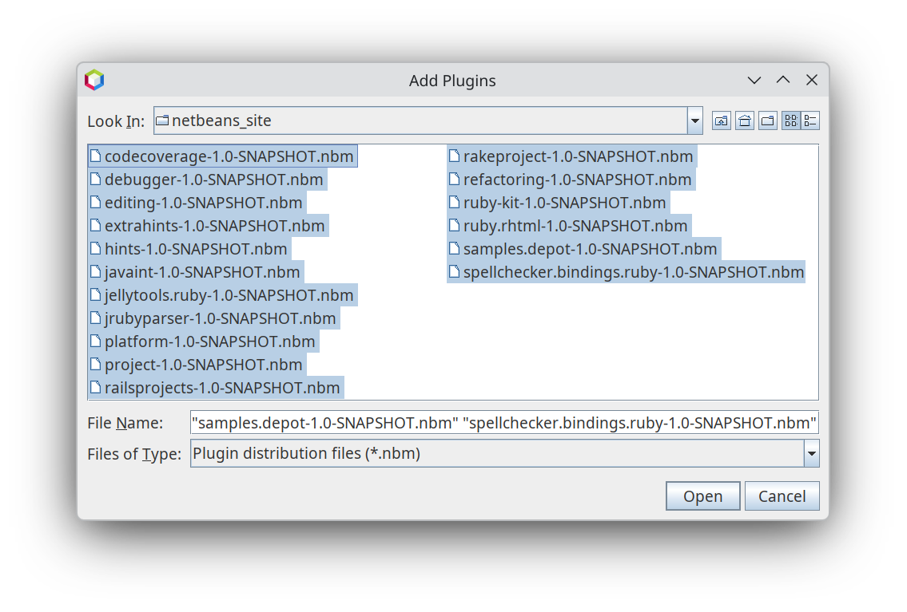
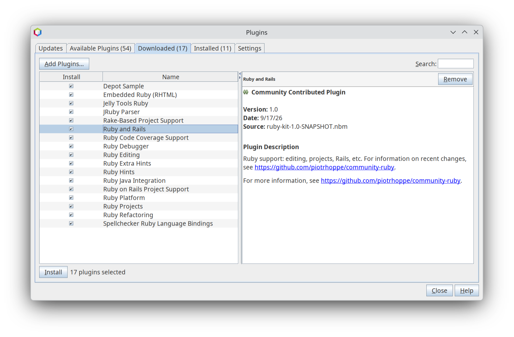

Community Ruby Plugin Installation
---

- go to releases and download latest [release](https://github.com/piotrhoppe/community-ruby/releases)
- unpack downloaded file
- run NetBeans and go to "Tools|Plugins > Downloaded" tab
- click on "Add Plugins..." button and go to the directory where you put the unpacked files and select all *.nbm files and click on the "Open" button

- when all plugins are selected click on the "Install" button and next follow the instructions
    

