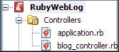

# Ruby
---
    
    
    
    
    
    

    
    
    ## NetBeans Ruby Support

    
    

     The NetBeans Ruby support plug-ins provide an integrated development environment for 
building, running, testing, and debugging Ruby and Ruby on Rails applications. 
You can download a Ruby-only version of the NetBeans IDE or add Ruby support to 
your NetBeans IDE  download. To learn how, 
see
     [Installing and Configuring Ruby Support](https://web.archive.org/web/20111030214144/http://www.netbeans.org/kb/docs/ruby/setting-up.html)
     . 
If you want to work on the bleeding edge, see the
     [Ruby Installation](../RubyInstallation/RubyInstallation.md)
     wiki page for information on getting the latest builds. The
     [Ruby Recent Changes](../RubyRecentChanges/RubyRecentChanges.md)
     page tracks the newest features.

    
    
    ### NetBeans Ruby Features

- [Editing](../RubyEditing/RubyEditing.md)
- [Refactoring](../RubyRefactoring/RubyRefactoring.md)
- [Projects](../RubyProjects/RubyProjects.md)
- [Ruby on Rails](../RubyOnRails/RubyOnRails.md)
- [Debugging](../RubyDebugging/RubyDebugging.md)
- [Unit Testing](../RubyTesting/RubyTesting.md)
- [Code Coverage Support](../RubyCodeCoverage/RubyCodeCoverage.md)
- [Rake Runner](../RubyRake/RubyRake.md)
- [Live Code Templates](../RubyCodeTemplates/RubyCodeTemplates.md)
- [Quickfixes and Hints](../RubyHints/RubyHints.md)
- [Keyboard Shortcuts](../RubyShortcuts/RubyShortcuts.md)
- [Additional Plugins](../RubyPlugins/RubyPlugins.md)
- [Ruby Gems Manager](../RubyGems/RubyGems.md)
- [Ruby Options](../RubyOptions/RubyOptions.md)

    
    
     Retrieved from "
     [http://wiki.netbeans.org/Ruby](../Ruby/Ruby.md)
     "
