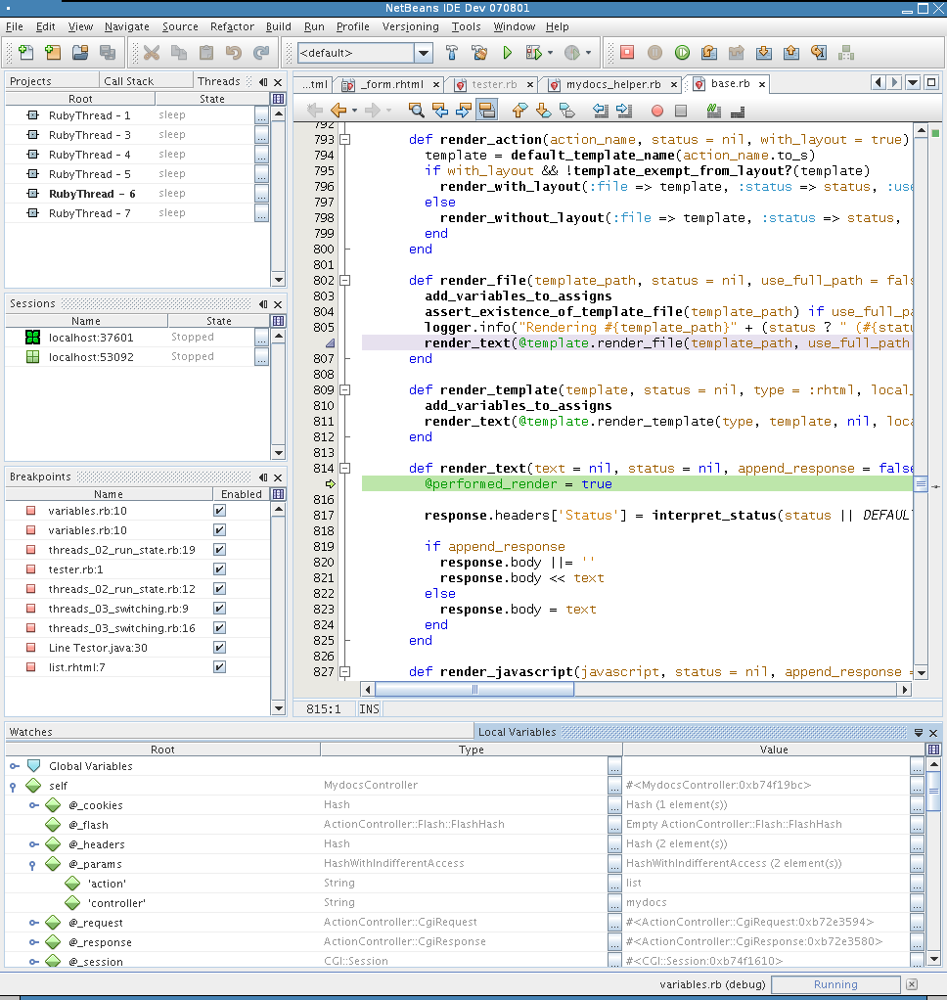
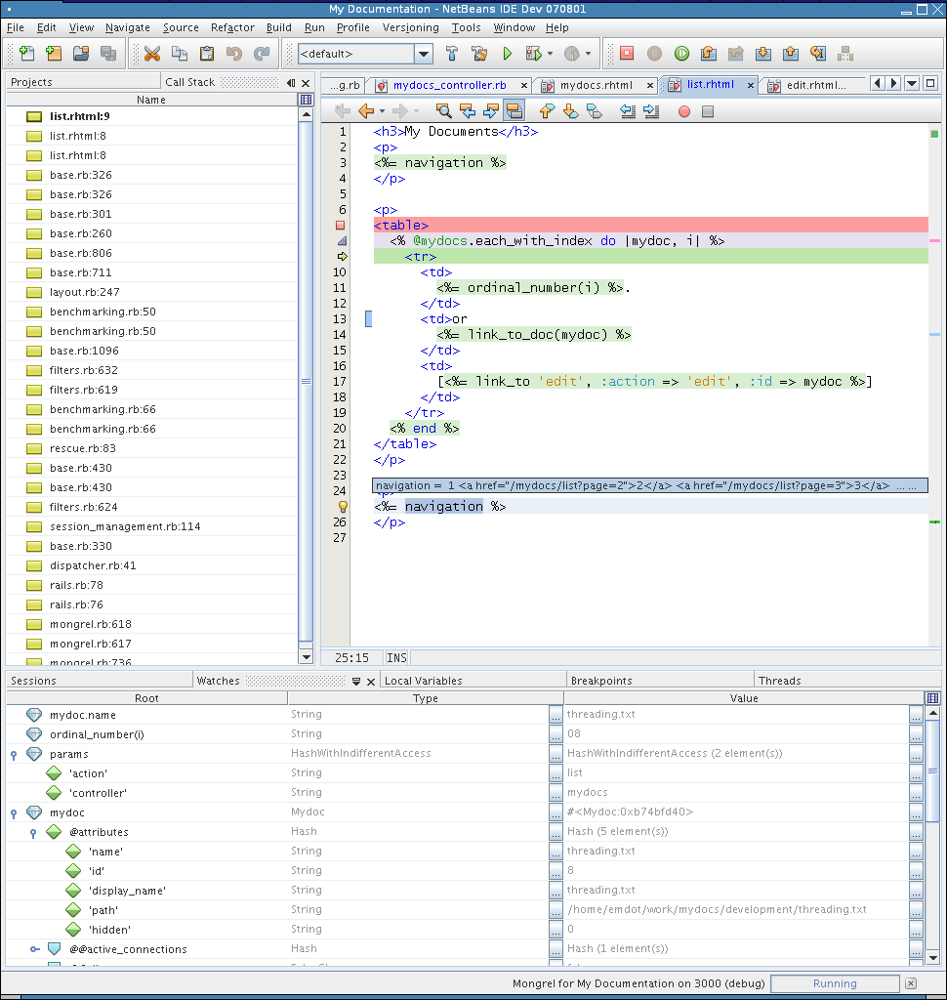

# RubyDebugging

# RubyDebugging

    
    
    
    
    
    
     
      
       The information on
       
        this page pertains to NetBeans IDE 6.5
       
       . If you are looking for information about
       
        Ruby Debugging in 6.1
       
       ,
       [look here](../RubyDebugging61/RubyDebugging61.md)
       . If about
       
        Ruby Debugging in 6.7
       
       ,
       [look here](../RubyDebugging67/RubyDebugging67.md)
       .
      
     
    
    

    
     
      
       
        ## Contents

       
       - [1
          
          
           Quickstart/Installation](#Quickstart.2FInstallation)
         
          
           [1.1
            
            
             Bundled JRuby](#Bundled_JRuby)
- [1.2
            
            
             MRI Ruby (C Ruby)](#MRI_Ruby_.28C_Ruby.29)
- [1.3
            
            
             JRuby](#JRuby)

        
        
         [2
          
          
           What is done](#What_is_done)
         - [2.1
            
            
             Screenshots list](#Screenshots_list)
- [2.2
            
            
             List of implemented features](#List_of_implemented_features)

        
        
         [3
          
          
           Troubleshooting](#Troubleshooting)
         - [3.1
            
            
             Problems during Fast Debugger installation](#Problems_during_Fast_Debugger_installation)
- [3.2
            
            
             Problems during usage - have latest pieces (Ruby, JDK)](#Problems_during_usage_-_have_latest_pieces_.28Ruby.2C_JDK.29)
- [3.3
            
            
             Timeout problem](#Timeout_problem)
- [3.4
            
            
             Clear userdir](#Clear_userdir)
- [3.5
            
            
             Firewall](#Firewall)
- [3.6
            
            
             Breakpoints not getting hit](#Breakpoints_not_getting_hit)
- [3.7
            
            
             Still not working](#Still_not_working)

        
        
         [4
          
          
           Known problems](#Known_problems)
        
        
         [5
          
          
           How to file a bug](#How_to_file_a_bug)
        
        
         [6
          
          
           Checking debugger engine functionality](#Checking_debugger_engine_functionality)
        
        
         [7
          
          
           General Architecture Overview](#General_Architecture_Overview)
         - [7.1
            
            
             Backends](#Backends)
- [7.2
            
            
             Intermediate library](#Intermediate_library)
- [7.3
            
            
             NetBeans frontend](#NetBeans_frontend)

        
        
         [8
          
          
           Testing](#Testing)
        
        
         [9
          
          
           Todo](#Todo)
        
        
         [10
          
          
           Future works](#Future_works)
        
        
         [11
          
          
           Screenshots](#Screenshots)
         - [11.1
            
            
             Ruby Debugging screenshot](#Ruby_Debugging_screenshot)
- [11.2
            
            
             RHTML Debugging screenshot](#RHTML_Debugging_screenshot)

        
       
      
     
    
    
     if (window.showTocToggle) { var tocShowText = "show"; var tocHideText = "hide"; showTocToggle(); }
    
    

    
    
    ### Quickstart/Installation

    
    
    #### Bundled JRuby

    
Works out-of-the box.

    
    
    #### MRI Ruby (C Ruby)

    
When a new debugging session is started IDE will automatically ask whether the fast debugger should be installed. Just say yes and you are done.

    
    
    #### JRuby

    
Automatic instalation for JRuby is not supported yet. You need to install two gems to get it working following steps below:

    
1. Manually download the ruby-debug-base-0.10.3.1-java.gem from
     [debug-commons](https://web.archive.org/web/20111104173935/http://rubyforge.org/frs/?group_id=3085)
     to a local directory.
     

     2. Install the Gem into your JRuby Gem repository:

    
```

jruby -S gem install -l ruby-debug-base-0.10.3.1-java.gem

```

    
3. Now install ruby-debug-ide with:

    
```

jruby -S gem install --ignore-dependencies -v 0.4.6 ruby-debug-ide

```

    
See
     [Troubleshooting section](../RubyDebugging/RubyDebugging.md)
     if you encounter problems.

    

    
    
    ### What is done

    
You might take a look at
     [screenshots](../RubyDebugging/RubyDebugging.md)
     which are sometime
     
      worth a thousand words
     
     .

    
    
    #### Screenshots list

    - [Ruby Debugging](../RubyDebugging/RubyDebugging.md)
      (Local Variables, Threads, Sessions and Breakpoints views, Call Stack annotations)
- [[[RubyDebugging#RHTMLDebuggingScreenshot| RHTML Debugging]] (Watches and Call Stack views, Baloon Evaluations)

    
    
    #### List of implemented features

    - classic-debugger support - slow, but universal, works with every Ruby compatible interpreter
- ruby-debug support - fast, but native extension, does work only with native Ruby interpreter
- RHTML debugging
- Balloon Evaluation. Holding mouse over text in the editor will evaluate underlying expression and show result in the tooltip.
- Views:

    
     
      - Local Variables
- Global Variables
- Watches
- Call Stack
- Breakpoints
- Session (multiple debugging session, finishing, switching support)
- Thread (state, thread switching support)

     
    
    - breakpoints management

    
     
      - line breakpoints
- exception breakpoints
- conditional breakpoints

     
    
    - stepping (over/into/out/resume) into project, core, loadpath classes, RHTML

    

    
    
    ### Troubleshooting

    
When Fast Debugger does not work, first check whether correct versions of ruby-debug-ide and ruby-debug-base gems are installed.

    - ruby-debug-base (0.10.3.1)
- ruby-debug-ide (0.4.6)

    
    
    #### Problems during Fast Debugger installation

    
Be sure you have GCC installed on your Unix-like system (Linux, Mac OS X, ...). You need to install it since Fast Debugger is native C Ruby extension and needs to be compiled.

    - on
      
       Mac OS X
      
      be sure you have installed
      
       Developer Tools
      
      . They're not installed by default but they're on the install CD's you get with Leopard.
- on
      
       Ubuntu
      
      (7.10 in the time of writing this) following packages need to be installed for compilation. Run:

    
```

sudo apt-get install build-essential autoconf

```

    
In the case you are using Ruby package from Ubuntu repository, be sure you also install
     
      ruby
      
       
      
      -dev
     
     package, like
     
      ruby1.8-dev
     
     or
     
      ruby1.9-dev
     
     . Otherwise you can't compile any native extensions. E.g.

    
```

sudo apt-get install ruby1.8-dev

```

    - on
      
       OpenSolaris 2008.05
      
      Run:

    
```

pfexec pkg install SUNWgcc

```

    
There's a bug where the rbconfig.rb file contains bogus paths (
     [6705310](https://web.archive.org/web/20111104173935/http://bugs.opensolaris.org/view_bug.do?bug_id=6705310)
     ) causing native extensions to fail to build. Prashant provides an updated rbconfig.rb via his blog,
     [Where's my Ruby](https://web.archive.org/web/20111104173935/http://blogs.sun.com/prashant/entry/where_s_my_ruby)
     . Run:

    
```

cd /usr/ruby/1.8/lib/ruby/1.8/i386-solaris2.11
pfexec mv rbconfig.rb rbconfig.rb.orig
pfexec wget http://blogs.sun.com/prashant/resource/gcc/rbconfig.rb

```

    - be sure you have correctly set up Ruby gems. There is separate wiki page for
      [setting up RubyGems](https://web.archive.org/web/20111104173935/http://wiki.netbeans.org/wiki/view/RubyGems#section-RubyGems-ANoteBeforeBeginning)
      (with special note for Fast Debugger and similar native extensions)

    
     
      - mainly you need to have sufficient permissions to your Gem repository. This might be workarounded this by installing Fast Debugger gem from command line using sudo or being logged in as root.
        
         sudo gem install ruby-debug-ide

     
    
    
    
    #### Problems during usage - have latest pieces (Ruby, JDK)

    
There were few issues caused by older Rubies or JDKs, thus it is best to use latest version of:

    - native Ruby. Version 1.8.6-p36 (default on Ubuntu 7.10) contains bug which might cause Segmentation Fault error on Linux (issue 127423). Latest version (in time of this writing) is the 1.8.7. - downloadable
      [here](https://web.archive.org/web/20111104173935/http://www.ruby-lang.org/en/downloads/)
- latest version of JDK/JRE - downloadable
      [here](https://web.archive.org/web/20111104173935/http://java.sun.com/javase/downloads/index.jsp)

    
    
    #### Timeout problem

    
If you get message similar to this one:

    
```

  Cannot connect to the debugged process in 15s
  But server process is running. You might try to increase the timeout. Killing...

```

    
you might try to increase timeout by passing

    
```
-J-Dorg.netbeans.modules.ruby.debugger.timeout=30
```

    
to NetBeans (here to 30s). But likely there is other bug, unless you have
slower computer. So if the timeout increasing does not help, follow below.

    
    
    #### Clear userdir

    
Sometime there might be some misconfiguration within your current userdir. So if nothing above works another
suggestion is to try to use different userdir, either deleting your current one (Help -> About to find it) or
start NetBeans with alternate one, in the case the current is somehow broken. See
     [this FAQ](https://web.archive.org/web/20111104173935/http://wiki.netbeans.org/FaqAlternateUserdir)
     for more information about NetBeans userdir

    
    
    #### Firewall

    
If you have some very restricted firewall you might try to turn it off.

    
    
    #### Breakpoints not getting hit

    - If you're on a Mac, make sure that the project directory doesn't have extended attributes. See
      [this](https://web.archive.org/web/20111104173935/http://www.netbeans.org/issues/show_bug.cgi?id=156410#desc22)
      for details.
- In a dual-boot Win/Linux system, debugging a project that resides on a Win partition
      [does not work on Linux](https://web.archive.org/web/20111104173935/http://www.netbeans.org/issues/show_bug.cgi?id=156410#desc26)
      .

    
    
    #### Still not working

    - The ruby-debug-ide package used by NetBeans requires that you have localhost correctly pointing to the 127.0.0.1 IP address. This is normally setup correctly in all operating systems by default. However, if you experience timeouts (sometimes inconsistently) in is worth checking that your
      [hosts file](https://web.archive.org/web/20111104173935/http://en.wikipedia.org/wiki/Hosts_file)
      contains the setting for localhost.
- if nothing above solved your problem, please either
      [file a bug](../RubyDebugging/RubyDebugging.md)
      or let us know about your problem on
      [NetBeans Ruby mailing lists](https://web.archive.org/web/20111104173935/http://ruby.netbeans.org/servlets/ProjectMailingListList)
      .

    

    
    
    ### Known problems

    - debugger stops on some statements like 'if', 'while' twice. This is caused by backends. To be fixed in the future.

    

    
    
    ### How to file a bug

    
Quick link:
     [File issue to Ruby Debugger](https://web.archive.org/web/20111104173935/http://www.netbeans.org/issues/enter_bug.cgi?component=ruby&subcomponent=debugger&version=6.5)

    
If you encounter any bugs and want to help killing them soon, please file a new issue into NetBeans Issuezilla -> just click this
     [direct link to Issuezilla](https://web.archive.org/web/20111104173935/http://www.netbeans.org/issues/enter_bug.cgi?component=ruby&subcomponent=debugger&version=6.8)
     which fills up everything for you (you might need to login/register firstly if you are not already).

    
Even
     
      more helpful is to turn on
     
     the debugger-related
     
      logging
     
     and attach the log into Issuezilla as well. See following simple steps.

    
     
      Running NetBeans with logging turned on. In 6.7 and later you can do this by checking the Enable Detailed Logging For Debugger checkbox in Tools->Options->Misc->Ruby, in earlier versions you need to:
     
    
    
     
      - either adding the text:
        

        
```
-J-Dorg.netbeans.modules.ruby.level=400 -J-Dorg.netbeans.api.ruby.platform.level=400 -J-Dorg.rubyforge.debugcommons.level=300 -J-Dorg.rubyforge.debugcommons.verbose=true
```

     
    
    
to your
     
      $NB_BIN/etc/netbeans.conf, property
     
     netbeans_default_options

    
     
      - or running NetBeans directly with those parameters, like:
        

        
```
$NB_BIN/bin/netbeans -J-Dorg.netbeans.modules.ruby.level=400 -J-Dorg.netbeans.api.ruby.platform.level=400 -J-Dorg.rubyforge.debugcommons.level=300 -J-Dorg.rubyforge.debugcommons.verbose=true
```

     
    
    
     
      When NetBeans starts up, reproduce the bug, so it is logged into the log files.
     
     
      Then file a new issue (
      [click this link](https://web.archive.org/web/20111104173935/http://www.netbeans.org/issues/enter_bug.cgi?component=ruby&subcomponent=debugger&version=6.8)
      ) and attach (or just
      [send me directly](https://web.archive.org/web/20111104173935/mailto:martin.krauskopf@sun.com)
      ):
      
       
        the content of IDE log file
        
         Menu -> View -> IDE Log File
        
        (or directly $YOUR_NB_USER_DIR/var/log/messages.log)
       
       
        the content of the Output Window
       
      
     
    
    
That's all, thanks.
You might want to check
     [current issues](https://web.archive.org/web/20111104173935/http://www.netbeans.org/issues/buglist.cgi?component=ruby&subcomponent=debugger&issue_status=NEW&issue_status=STARTED&issue_status=REOPENED)
     whether the problem is not already known.

    

    
    
    ### Checking debugger engine functionality

    
In cases when there are some problem with the debugger and it is not clear from the logs what is the culprit, it is good to test debugger engine itself from command line, to narrow the culprit to either backend or the communication with frontend (NetBeans here).

    
To test the engine, create a Ruby project in NetBeans
     
      Menu | File | New Project | Ruby | Ruby Application
     
     , then start a console (
     
      cmd
     
     on Windows, some terminal on Linux or Mac). Go to the directory where the project was created and start there a debugger backend with the debuggee as a parameter:

    
```

rdebug-ide _0.4.6_ -p 1234 -d -- lib/main.rb

```

    
Start other terminal and connect to debugger with telnet:

    
```

telnet localhost 1234

```

    
and type the following commands:

    - b main.rb:4
- start
- cont

    
You should see following output which show that the debugger stopped on the line
     
      4
     
     of the
     
      main.rb
     
     script. If not, do you something wrong is happening there, like Segmentation Fault, or any other culprit. Such info is handy to the developers, since if it does not work we know the problem is in the backend. If it does work we know that the problem is on the Java side (NetBeans or communication library).

    
Terminal 1:

    
```

~/NetBeansProjects/RubyApplication1$ rdebug-ide _0.4.6_ -p 1234 -d -- lib/main.rb
Waiting for connection on 'localhost:1234'
Fast Debugger (ruby-debug-ide 0.4.6) listens on localhost:1234
Starting command read loop
Processing: b main.rb:4

Processing: start
Starting: running program script

Stopping Thread #
Threads equal: true
Processing: cont
Processing context: cont
Resumed Thread #
Hello World

```

    
Terminal 2:

    
```

$ telnet localhost 1234
Trying 127.0.0.1...
Connected to localhost.
Escape character is '^]'.
b main.rb:4
start
cont
Connection closed by foreign host.

```

    

    
    
    ### General Architecture Overview

    
Ruby Debugger architecture for NetBeans consists of the following three layers:

    - backends written in C/Ruby
- intermediate communication library written in Java, intermediating

    
communication between the backends and a frontend

    - frontend - NetBeans module

    
    
    #### Backends

    
NetBeans utilizes
     [debug-commons](https://web.archive.org/web/20111104173935/http://debug-commons.rubyforge.org/)
     project from
     [RubyForge](https://web.archive.org/web/20111104173935/http://rubyforge.org/)
     . This project is common effort of RDT developers (mainly Markus Barchfeld) and ours. All backend works are being done there. More on the project's pages.

    
    
    #### Intermediate library

    
It is an IDE-independent Java library intermediating communication between various Ruby debugging backends and a frontend. It is based on the one that was in RDT but with slightly remade threading part and others part refactored. Also this library will be kept and developed as part of debug-commons since it is supposed to be developed by all interested parties in the future. It uses
     [kxml2](https://web.archive.org/web/20111104173935/http://kxml.sourceforge.net/kxml2/)
     XML Pull Parser implementation which needs to be bundled within a frontend. To be considered whether it is really needed. Should be probably possible to use any/custom XPP implementation. I need to elaborate on this. Not a high priority though.

    
    
    #### NetBeans frontend

    
Standard NetBeans module utilizing libraries/layers above.

    

    
    
    ### Testing

    
Preferred testing platform is Windows since I'm developing and continually testing debuggers on Linux (and thus also cover - more or less; the Mac OS X).

    

    
    
    ### Todo

    - ... probably a lot of minors, I'll be updating this regularly. See
      [current issues list in Issuezilla](https://web.archive.org/web/20111104173935/http://www.netbeans.org/issues/buglist.cgi?component=ruby&subcomponent=debugger&issue_status=NEW&issue_status=STARTED&issue_status=REOPENED)

    

    
    
    ### Future works

    - remote debugging (
      [issue #104473](https://web.archive.org/web/20111104173935/http://www.netbeans.org/nonav/issues/show_bug.cgi?id=104473)
      )
- cross-language debugging (ruby-to-java and vice-versa -
      [issue #135357](https://web.archive.org/web/20111104173935/http://www.netbeans.org/issues/show_bug.cgi?id=135357)
      )
- when paused at a breakpoint, allow access to the console to send commands straight to the interpreter. This way we can query more exactly what's going and would be invaluable. (In firebug, when debugging JS, you can switch to console at any time, and interactively see what's going on)
- ... ideas?

    

    
    
    ### Screenshots

    
    
    #### Ruby Debugging screenshot

    
Local Variables, Threads, Sessions and Breakpoints views, Call Stack annotations
     

     [](/web/20111104173935/http://wiki.netbeans.org/File:Debugger_02_RubyDebugging.png)

    
    
    #### RHTML Debugging screenshot

    
Watches and Call Stack views, Baloon Evaluations
     

     [](/web/20111104173935/http://wiki.netbeans.org/File:Debugger_01_RubyDebugging.png)

    
    
     Retrieved from "
     [http://wiki.netbeans.org/RubyDebugging](../RubyDebugging/RubyDebugging.md)
     "
