# RubyEditing

This page provides status on editing for NetBeans
     [Ruby](../Ruby/Ruby.md)
     support.

    
For a (dated) demo, see
     [http://www.netbeans.org/download/flash/jruby_editing/jruby_editing.html](https://web.archive.org/web/20111120002454/http://www.netbeans.org/download/flash/jruby_editing/jruby_editing.html)

    
As of June 5th 2007 the following features are provided:

## Contents

- [1 Colors](#colors)
- [2 Syntax highlighting](#syntax-highlighting)
- [3 Navigation display](#navigation-display)
- [4 Code Folding](#code-folding)
- [5 Background error parsing](#background-error-parsing)
- [6 Semantic syntax highlighting,](#semantic-syntax-highlighting)
- [7 Mark Occurrences](#mark-occurrences)
- [8 Go To Declaration](#go-to-declaration)
- [9 Instant Rename](#instant-rename)
- [10 Code Templates](#code-templates)
- [11 Code Completion](#code-completion)
- [12 Parameter Hints](#parameter-hints)
- [13 Smart Indent](#smart-indent)
- [14 Smart Selection](#smart-selection)
- [15 Formatting](#formatting)
- [16 Pair Matching](#pair-matching)
- [17 Live Code Templates](#live-code-templates)
- [18 RDoc Support and String Support](#rdoc-support-and-string-support)
- [19 Spell Checking](#spell-checking)
- [20 Type Assertions](#type-assertions)
- [21 Type Inference](#type-inference)

#### Colors

The following screenshot explains the various colors you may see in the editor, and their meanings. This obviously differs from theme to theme, and the default theme is shown here:

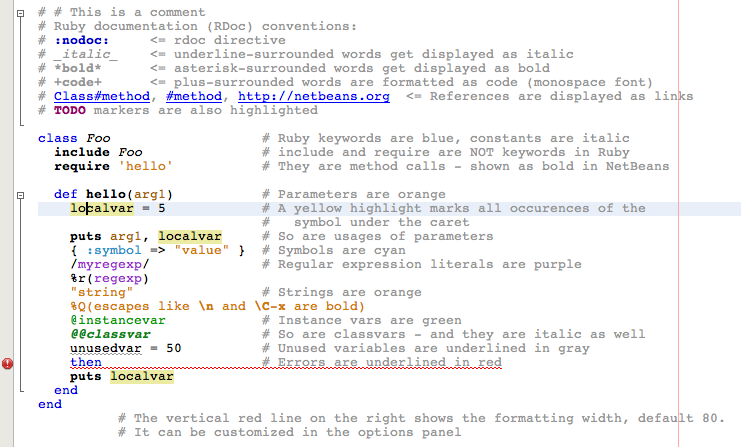

#### Syntax highlighting

Lexical scanning is done using JRuby's scanner. This identifies, for example, global variables and instance variables.
As in the Java editor, fields are shown in green. The editor also knows about Ruby's identifiers, so double-clicking in
the editor to select the symbol under the mouse click will include non-Java identifier characters like @, $, etc.

#### Navigation display

The navigator displays the structure of the file, from modules down to individual methods, fields, and attributes. 
Double-clicking on an element in the navigator window warps to its source in the editor.

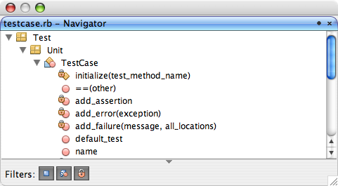

The structure analyzer is aware of Ruby constructs: `attr, attr_accessor, attr_reader, module_function`
etc will all properly construct fields, singleton methods etc. that are included in navigation and code completion.

The filtering checkbuttons allow you to filter out private methods, fields, etc.

#### Code Folding

Modules, classes, and methods are foldable.

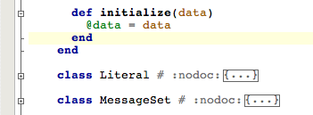

#### Background error parsing

TheJRuby parser is run in the background when the user stops typing, and provides error messages as error annotations.
On a successful parse, the parse tree is used to drive additional features. (And in the future, JRuby will hopefully
provide partial parse trees even on erroneous Ruby files.)

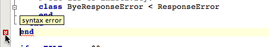

#### Semantic syntax highlighting,

This identifies method calls and definitions, parameters, and unused variables.

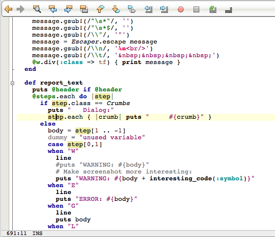

#### Mark Occurrences

Placing the caret on an element (such as a local variable, dynamic variable, instance variable, global variable,
method call, or class reference) will highlight all other references as well as redefinitions of the current symbol.

The first example shows parameters highlighted when you place the caret on one of them:

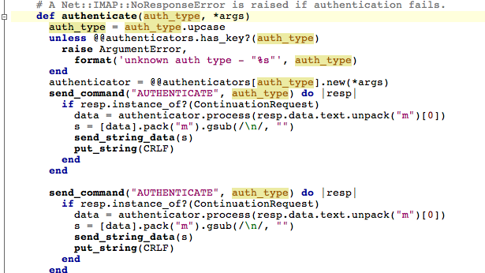

If you place the caret on a method definition, it will highlight all the potential exit points (the last statement of
the method, as well as any `return, yield, return` or `fail` statements.)

#### Go To Declaration

Right click on an element and choose Go To > Declaration, and it will warp to the declaration for the element,
if possible. (Note - this is still highly experimental. It will work right for local variables and dynamic
variables, but for methods and such it needs to include the type inference prototype as well as some other
facilities for finding references in the builtin libraries.)

This feature is also available via editor hyperlinks - hold the Control key (or the Command key on the mac) and
as you drag the mouse over the source, identifiers are highlighted as hyperlinks. Clicking on a hyperlink will
warp to its source if possible.

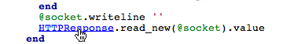

#### Instant Rename

Renaming a local or dynamic variable is done in place and all references are updated on the fly. To invoke,
right click on the element. On OSX, the keybinding is Command-R.

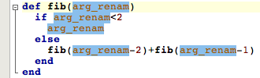

#### Code Templates

Some basic code templates are available for Ruby. We need more. If you have any constructs you'd like
to be exposed as a live code template (e.g. a parameterized code template) let me know.

#### Code Completion

Some basic code completion is provided. When you hit Ctrl-Space, completion is provided for local variables
and dynamic variables in the current block, as well as method names, class names and constants in the 
same file.

In addition, various Ruby builtins such as keywords and predefined constants are provided.

This is an area where further research is going to yield some improvements using Type inference,
a symbol cache from the builtin libraries, etc.

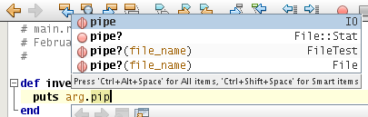

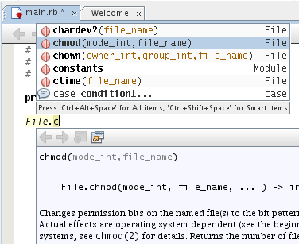

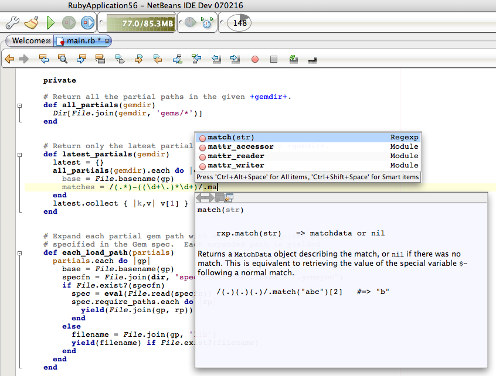

When there is associated ruby documentation (rdoc) for a program element, it is displayed
in a documentation popup adjacent to the code completion window, as shown in the
following screenshot:

[File:completion-docs_RubyEditing.png](images/Completion-docs_RubyEditing.png)

There is documentation for some builtin keywords as well, based on
Charlie's ruby spec ([http://www.headius.com/rubyspec/index.php/Ruby_Language](http://www.headius.com/rubyspec/index.php/Ruby_Language))

[File:ruby-keyword-help_RubyEditing.png](images/Ruby-keyword-help_RubyEditing.png)

Code completion also provides help in specific contexts. For example, if
you invoke code completion within the string of a require or load statement,
it lists available imports:

[File:require-completion_RubyEditing.png](images/Require-completion_RubyEditing.png)

If you invoke it in while typing a regular expression, it helps
you with the regular expression syntax:

[File:regexp-completion_RubyEditing.png](images/Regexp-completion_RubyEditing.png)

And if you're typing Ruby code and can't remember the names or meanings of
dollar variables, or what the escapde codes are following a percent sign,
use code completion:

[File:dollar-completion_RubyEditing.png](images/Dollar-completion_RubyEditing.png)
[File:percent-completion_RubyEditing.png](images/Percent-completion_RubyEditing.png)

There are more scenarios; for example, invoking code completion after
a "def" keyword will only list inherited methods from the superclasses,
and so on. This is an area where we can probably tweak, tweak, and then
tweak some more.

The code completion rendering of RDoc is also able to provide Ruby syntax
highlighting for embedded code fragments, as shown here:

[[1]](https://blogs.sun.com/tor/resource/improved-rdoc2_RubyEditing.png)

#### Parameter Hints

Hit `<kbd>Alt</kbd>-<kbd>P</kbd>` (or `Ctrl-P`) to see the parameters for the current method call. The current
parameter being edited is shown in bold. (This relies on figuring out the method
signature for the method being called, which isn't always possible.)

[File:param-hints_RubyEditing.png](images/Param-hints_RubyEditing.png)

#### Smart Indent

Pressing Return to create a new line causes the new line to be indented appropriately, e.g. same
line as the previous line, or further indented when a new block is establishes, e.g. in an if statement,
case statement, etc.

Smart indent does not only occur when hitting newline: If you type "end" at the beginning of a line,
it will reindent the line such that the end is aligned with the corresponding opening statement,
such as class, def, for, etc.  If you continue typing (where "end" was simply the prefix of 
for example endiandCheck()), the line will get reindented to its original position immediately.

#### Smart Selection

If you press `Alt-Shift-PERIOD (.)` and `Alt-Shift-COMMA (,)` (on the Mac `Ctrl-Shift-PERIOD` and 
`Ctrl-Shift-COMMA`), the editor will select
progressively larger/smaller code blocks around the caret. For example,
if you're within a `for` block, it will first select the for block,
then the surrounding `if` block, then the method definition, then the class,
then the module. Within a comment, first the line is selected, then the
whole comment block, then whatever logical code block surrounds the comment.

#### Formatting

Reformat will reindent the source code using the same logic that Smart Indent is using. There
is also a Pretty Printer (which will go a bit further in reorganizing code, adding or removing
parentheses, etc). The Pretty Printer is incomplete and is not yet enabled.

#### Pair Matching

The editor automatically highlights matching parentheses, braces, brackets, string delimiters,
regular expression delimiters, etc. In addition, as you're editing, the editor tries to
automatically insert (and remove) matching delimiters automatically without getting in the way.
For example, if you type "%x{", the editor modifies the document to contain "%x{|}", and if
you then type the closing "}", it removes the previous "}" such that the document contains
the intended text. The important part here is that while you're editing, the file stays
valid such that code completion will work etc.

Pair Matching works on blocks as well.  If you type "for something" and hit Return, an
"end" statement will automatically be inserted if appropriate. Similarly for closing
braces in blocks.

It also works on =begin/=end pairs, as well as here-docs: Try typing
`x = << FOO` and pressing Return.

#### Live Code Templates

Also known as snippets or abbreviations, this feature lets you quickly insert snippets of 
code into your editor. The snippets can contain logical parameters which are evaluated
at expansion time, and kept in sync as you are editing them. Press tab to move from one
parameter to the next.

For example, let's say you define the following snippet:

[File:create-template_RubyEditing.png](images/Create-template_RubyEditing.png)

This snippet is named "dob", and if you type "dob" followed by tab in the following
example, you end up with a do block.  Notice how at expansion time,
the live code template picked an unused variable name among the candidates;
the NetBeans live templates can use semantic program information.

[File:find-unused-local_RubyEditing.png](images/Find-unused-local_RubyEditing.png)

Here's another logical snippet using semantic information:

[File:create-ctx-template_RubyEditing.png](images/Create-ctx-template_RubyEditing.png)

And here's what it exands to; note that when determining the superclass it doesn't
necessarily just look at the current file; if you were just adding a method to the
`Integer` class, it would correctly report `Numeric` as the superclass:

[File:ctx-expansion_RubyEditing.png](images/Ctx-expansion_RubyEditing.png)

The TextMate snippets have been converted and are bundled with the IDE by default.
More details on these are described in the [RubyCodeTemplates](../RubyCodeTemplates/RubyCodeTemplates.md) document.

#### RDoc Support and String Support

Comments containing RDoc tags or directives will show the RDoc directives as highlighted. Similarly,
quoted strings will show the escape sequences in bold.

[File:rdoc-comments_RubyEditing.png](images/Rdoc-comments_RubyEditing.png)

Embedded code fragments within String literals and regular expressions is also supported, as shown
here:

[File:ruby-embedded-strings_RubyEditing.png](images/Ruby-embedded-strings_RubyEditing.png)

#### Spell Checking

Spell checking is available as a plugin; spell checking is performed not only in
Ruby comments but in RHTML text as well.  The spell checker knows about RDoc conventions
to avoid providing false positives on method names, links, symbols, etc.

[File:base_typos2_RubyEditing.png](images/Base_typos2_RubyEditing.png)

This feature is not in the standard builds; you can
     [download a plugin](https://web.archive.org/web/20111120002454/http://blogs.sun.com/tor/entry/ruby_screenshot_of_the_week16)
     to get it.

#### Type Assertions

To be completed.  In meantime refer to:
     [http://blogs.sun.com/tor/date/20090113](https://web.archive.org/web/20111120002454/http://blogs.sun.com/tor/date/20090113)

updated Mar 14 by
     [TorNorbye](/web/20111120002454/http://wiki.netbeans.org/TorNorbye)

Last updated 22 Jan 09 by
     [greg](/web/20111120002454/http://wiki.netbeans.org/wiki/index.php?title=Greg&action=edit&redlink=1)

#### Type Inference

In 6.7 you can enable enhanced type inference in Options -> Miscellaneous -> Ruby.

[File:ti_options_RubyEditing.png](images/Ti_options_RubyEditing.png)

Once enabled, the IDE will try to infer return types for methods and display those types in the navigator and in the code completion dialog. Inferring method types might be slow for some projects and there are certain constructs that the IDE don't know how to infer as of now, so it is not 100% accurate.

Retrieved from "[http://wiki.netbeans.org/RubyEditing](../RubyEditing/RubyEditing.md)"
