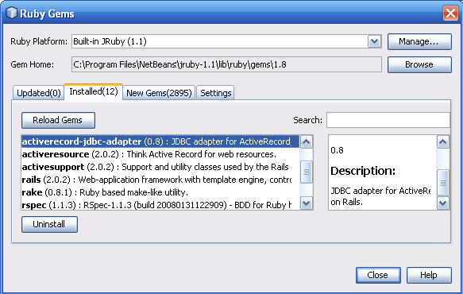
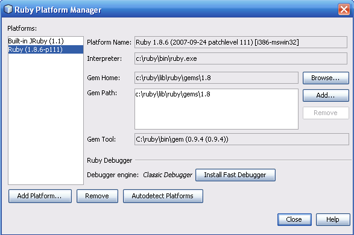
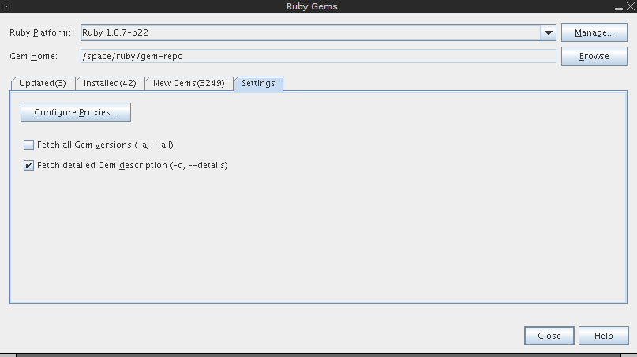
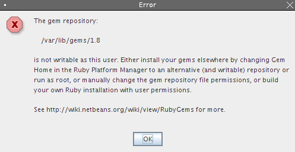

# RubyGems

# RubyGems

    
    
    
    
    
    
     
      
       The information on
       
        this page pertains to NetBeans IDE 6.5
       
       . If you are looking for information about
       
        Ruby Gems in 6.1
       
       ,
       [look here](../RubyGems61/RubyGems61.md)
       .
      
     
    
    

    
     
      
       
        ## Contents

       
       - [1
          
          
           Installing Gems](#Installing_Gems)
         
          
           [1.1
            
            
             Installing Gems From the Command Line](#Installing_Gems_From_the_Command_Line)
- [1.2
            
            
             Installing Gems From the IDE](#Installing_Gems_From_the_IDE)

        
        
         [2
          
          
           Tweaking Gem Manager Behaviour](#Tweaking_Gem_Manager_Behaviour)
        
        
         [3
          
          
           Troubleshooting](#Troubleshooting)
         - [3.1
            
            
             RubyGems needs to be installed](#RubyGems_needs_to_be_installed)
- [3.2
            
            
             Gems fetching failed](#Gems_fetching_failed)
- [3.3
            
            
             Sudo password is refused by RubyGems manager](#Sudo_password_is_refused_by_RubyGems_manager)
- [3.4
            
            
             Permission problems](#Permission_problems)
- [3.5
            
            
             Problem with installing Gems that use native extensions](#Problem_with_installing_Gems_that_use_native_extensions)
- [3.6
            
            
             Gems fetching takes forever](#Gems_fetching_takes_forever)
- [3.7
            
            
             Installing your own private copy of Ruby](#Installing_your_own_private_copy_of_Ruby)
- [3.8
            
            
             Installing FastDebugger on Debian (testing).](#Installing_FastDebugger_on_Debian_.28testing.29.)

        
       
      
     
    
    
     if (window.showTocToggle) { var tocShowText = "show"; var tocHideText = "hide"; showTocToggle(); }
    
    

    
    
    ### Installing Gems

    
You can install gems from the command line or you can use the NetBeans Gems Manager.

    
    
    #### Installing Gems From the Command Line

    - To learn how to install gems in JRuby, see this "Getting Started"
      [how-to](https://web.archive.org/web/20111127132951/http://wiki.jruby.org/wiki/Getting_Started#Installing_and_using_Gems_in_JRuby)
      on the
      [JRuby wiki](https://web.archive.org/web/20111127132951/http://wiki.jruby.org/wiki)
      .
- For native Ruby platforms, the command line instructions can be found in the
      [RubyGems Command Reference](https://web.archive.org/web/20111127132951/http://docs.rubygems.org/read/chapter/10#page33)
      at
      [rubygems.org](https://web.archive.org/web/20111127132951/http://rubygems.org/)
      .

    
    
    #### Installing Gems From the IDE

    
To install gems from the IDE, choose Tools > Ruby Gems from the main menu, and select the Ruby Platform to which you want to install the gem.

    
[](/web/20111127132951/http://wiki.netbeans.org/File:Gemsmgr_RubyGems.png)

    
If this is the first time you are using the Ruby Gems manager, you might want to click the Manage button to open the Ruby Platform Manager. Make sure that the Gem Home, Gem Path, and Gem Tool settings are correct. (If you are not sure of the difference between Gem Home and Gem Path, click Help to see the definitions).

    
[](/web/20111127132951/http://wiki.netbeans.org/File:ChooseRuby_RubyGems.png)

    
Tip:
     
     If you are using the JRuby interpreter that comes bundled with the product, you might want to set up a different Gem Home. That way, if you install a later version of the IDE, or if you install a separate JRuby interpreter, you can continue to use that repository. Note that when you uninstall the IDE, the uninstaller will not uninstall the JRuby repository that is under the installation directory if you have added stuff to it. Which is another good reason to set up the Gem Home elsewhere.

    
Note:
     
     If the Gem Home and Gem Path directories require root access, see the
     [Troubleshooting](../RubyGems/RubyGems.md)
     section for important information about permission problems.

    

    
    
    ### Tweaking Gem Manager Behaviour

    
When you want to speed up gems fetching a little bit you might turn off retrieving of:

    - gems descriptions
- all available gems versions. Only latest ones will be shown.

    
You can do this in the 'Settings' tab in the in the RubyGems Manager as shown on the following screenshot:
     

     

     [](/web/20111127132951/http://wiki.netbeans.org/File:Rubygems_settings_RubyGems.png)

    
On the background this simulates using (or not) following options of the
     
      gem
     
     tool:

    
```

  -d, --[No-]details               Display detailed information of gem(s)
  -a, --all                        Display all gem versions

```

    
    
    ### Troubleshooting

    
This section provides solutions for some of the common problems you might encounter when you use the Ruby Gems manager.

    

    
    
    #### RubyGems needs to be installed

    
In order to use the
     
      gem
     
     command, you must install RubyGems into your Ruby
installation. If you are using the bundled JRuby installation, this is already
the case. See the
     [Installing RubyGems](https://web.archive.org/web/20111127132951/http://rubygems.org/read/chapter/3)
     chapter in the
     
      RubyGems User Guide
     
     at
     [rubygems.org](https://web.archive.org/web/20111127132951/http://rubygems.org/)
     for information on how to install RubyGems.

    
    
    #### Gems fetching failed

    
NetBeans just uses
     
      gem
     
     tool on the background. If the gems fetching fails
for you, be sure to check whether it works from command line, particularly the following commands:

    
```

gem list --local --details
gem list --remote --details

```

    
If it
     
      does
     
     work, please
     [let us know](../RubyFeedback/RubyFeedback.md)
     about your problem.

    
If it
     
      does not
     
     work from command line as well but command like:

    
```

gem list -l
gem list -r

```

    
does pass, then you might try to tweak the Gem Manager as described in the [Tweaking Gem Manager
Behaviour|RubyGems#TweakingGemManagerBehaviour] section, particularly uncheck the
     
      Fetch detailed Gem
     
     description
     
      option.

    

    
    
    #### Sudo password is refused by RubyGems manager

    
This is due to the fact, that NetBeans needs real
     
      root
     
     password, not just user password which is needed by default by
     
      sudo
     
     from command line. On some distribution like Ubuntu, the root password is not set by default. You might set it with:

    
```
$ sudo passwd root
```

    
This should be fixed by bringing Terminal Emulator (
     [Issue 147024](https://web.archive.org/web/20111127132951/https://www.netbeans.org/bugzilla/show_bug.cgi?id=147024)
     .

    

    
    
    #### Permission problems

    
The IDE also needs to have write permissions on the gems repository in order to install, upgrade, and uninstall gems.
If you have switched to /usr/bin/ruby on your Linux box, for example, the RubyGems installation
directory is probably not writable without root privileges. The IDE will inform you of
this problem, linking to this wiki page, with the following dialog:
     

     

     [](/web/20111127132951/http://wiki.netbeans.org/File:Permission_error_RubyGems.png)
     

     

     There are several ways to solve this:

    - Install your own private copy of Ruby somewhere else, and use that instead. Remember not to run the make installation step as root. See below section "Installing your own private copy of Ruby on Ubuntu".

    - Make the repository writeable
      
      . Change the directory's write permissions to enable the IDE to write files there.

    
Here's an example how
     
      joe
     
     changes the permission of repository in
     
      /var/lib/gems/
     
     (the default on Ubuntu), which had root-owned files, to allow him to to run
     
      gem
     
     without root access:

    
```

joe@rubycomp:~$ cd /var/lib/gems/
joe@rubycomp:/var/lib/gems$ sudo chown -fR joe .
[Sudo] password for joe:

```

    - Run NetBeans as
       
        root
       
      
      . I don't recommend this approach.

    - Create a private repository for your gems
      
      . This will save you the trouble of installing your private copy of Ruby, while keeping your system's security intact. To do this, choose Tools > Ruby Platforms to open the Ruby Platform Manager (If you are in the Ruby Gems manager, you can click the Manage button to open the Ruby Platform Manager). Click the Browse button. Navigate to where you want to put the gems repository and click the New Folder button in the file browser. Name the new folder, select it, and click Open. Answer OK to the question about setting up a new repository in the new folder.

    

    
    
    #### Problem with installing Gems that use native extensions

    
Some RubyGems use native extension. That is they are (partially) written in C and thus need to be compiled during installation. If you encounter kind of
     
      failed to build native extensions
     
     problems during Gem installation, be sure:

    - You are not using JRuby interpreter at the moment, which cannot build native C extensions (there are often counterpart extensions written in Java, you might try to find them).
- You have GCC installed on your Unix-like system (Linux, Mac OS X, ...) so the native compilation is possible.

    
     
      - on
        
         Mac OS X
        
        be sure you have installed
        
         Developer Tools
        
        . They're not installed by default but they're on the install CD's you get with Leopard.
- on
        
         Ubuntu
        
        (7.10 in the time of writing this) following packages need to be installed for compilation. Run:

     
    
    
```

sudo apt-get install build-essential autoconf

```

    
In the case you are using Ruby package from Ubuntu repository, be sure you also install
     
      ruby
      
       
      
      -dev
     
     package, like
     
      ruby1.8-dev
     
     or
     
      ruby1.9-dev
     
     . Otherwise you can't compile any native extensions. E.g.

    
```

sudo apt-get install ruby1.8-dev

```

    
Please update this Wiki page section for your OS if it is not mentioned here yet.

    

    
    
    #### Gems fetching takes forever

    
NetBeans delegates the gems fetching to the underlaying
     
      gem
     
     tool. So if it takes very long time, it will be very likely the same from command line. Problem was usually with older version of RubyGems in version lesser then
     
      1.2.0
     
     . In RubyGems
     
      1.2.0
     
     and later, there are better caching mechanism and better memory management, so it
     
      strongly recommended
     
     to run the
     
      latest stable RubyGems
     
     - see the
     [Installation Guide](https://web.archive.org/web/20111127132951/http://docs.rubygems.org/read/chapter/3)
     .
You might also try to turn off fetching of detailed descriptions and/or fetching of all versions of each gem. See
     [Tweaking Gem Manager Behaviour](../RubyGems/RubyGems.md)
     above.
If you think the bug is in NetBeans your
     [feedback](../RubyFeedback/RubyFeedback.md)
     is welcomed.

    

    
    
    #### Installing your own private copy of Ruby

    
Take a look at
     [this page](../RubyInstallingOwnRuby/RubyInstallingOwnRuby.md)
     to see how to install Ruby on some systems.

    

    
    
    #### Installing FastDebugger on Debian (testing).

    
Not sure it's the best solution, but you can setup fast debugger in a few simple steps without creating your own gems repository.

    
Install ruby-debug-ide:

    
```

spectator:/$ sudo gem install ruby-debug-ide

```

    
Make symbolic link:

    
```

spectator:/$ sudo ln -s /var/lib/gems /usr/lib/ruby/gems

```

    
That's all! Your IDE will detect the installed fast debugger and will use it by default.

    
    
     Retrieved from "
     [http://wiki.netbeans.org/RubyGems](../RubyGems/RubyGems.md)
     "
