# RubyHints

# RubyHints

    
    
    
    
    
    
     
      
       
        ## Contents

       
       - [1
          
          
           Ruby Hints And Quick Fixes](#Ruby_Hints_And_Quick_Fixes)
- [2
          
          
           Standard Hints](#Standard_Hints)
         
          
           [2.1
            
            
             Block variable aliases local variable - Unintentional side effect?](#Block_variable_aliases_local_variable_-_Unintentional_side_effect.3F)
- [2.2
            
            
             Rails Deprecations](#Rails_Deprecations)
- [2.3
            
            
             Code block on single line](#Code_block_on_single_line)

        
        
         [3
          
          
           Additional Hints](#Additional_Hints)
         - [3.1
            
            
             Nested local variable](#Nested_local_variable)
- [3.2
            
            
             Convert between {}-blocks and do/end blocks](#Convert_between_.7B.7D-blocks_and_do.2Fend_blocks)
- [3.3
            
            
             Uppercase constant name check](#Uppercase_constant_name_check)
- [3.4
            
            
             CamelCase name alert](#CamelCase_name_alert)
- [3.5
            
            
             Check identifiers for unsafe characters](#Check_identifiers_for_unsafe_characters)
- [3.6
            
            
             Find actions without corresponding view files](#Find_actions_without_corresponding_view_files)
- [3.7
            
            
             Local Attributes](#Local_Attributes)

        
        
         [4
          
          
           Error Fixes](#Error_Fixes)
         - [4.1
            
            
             Incorrect =begin/=end blocks](#Incorrect_.3Dbegin.2F.3Dend_blocks)
- [4.2
            
            
             Parenthesize Arguments](#Parenthesize_Arguments)
- [4.3
            
            
             Extract Method](#Extract_Method)
- [4.4
            
            
             Introduce Field, Introduce Constant, Introduce Variable](#Introduce_Field.2C_Introduce_Constant.2C_Introduce_Variable)
- [4.5
            
            
             Accidental Assignments](#Accidental_Assignments)

        
        
         [5
          
          
           Experimental Hints](#Experimental_Hints)
         - [5.1
            
            
             Reverse Conditional Logic](#Reverse_Conditional_Logic)
- [5.2
            
            
             Convert To Statement Modifier](#Convert_To_Statement_Modifier)
- [5.3
            
            
             RubyGem Deprecations](#RubyGem_Deprecations)
- [5.4
            
            
             Other Deprecations](#Other_Deprecations)
- [5.5
            
            
             Retry Outside Rescue](#Retry_Outside_Rescue)
- [5.6
            
            
             Case/When Statements With Colons](#Case.2FWhen_Statements_With_Colons)
- [5.7
            
            
             Hash List Conversion](#Hash_List_Conversion)

        
        
         [6
          
          
           Preferences](#Preferences)
        
       
      
     
    
    
     if (window.showTocToggle) { var tocShowText = "show"; var tocHideText = "hide"; showTocToggle(); }
    
    

    
    
    ### Ruby Hints And Quick Fixes

    
The Ruby editor supports pluggable quickfixes and hints.

    
More information about this is available in
     [this blog entry](https://web.archive.org/web/20111127134140/http://blogs.sun.com/tor/entry/ruby_screenshot_of_the_week15)
     and
     [this blog entry](https://web.archive.org/web/20111127134140/http://blogs.sun.com/tor/entry/ruby_screenshot_of_the_week14)
     (the material will be added to the wiki soon).

    
Ideas for additional quick fixes can be found in
     [RubyCodeIdeas](../RubyCodeIdeas/RubyCodeIdeas.md)
     - please contribute your ideas there or via the issue tracker.

    
    
    ### Standard Hints

    
    
    #### Block variable aliases local variable - Unintentional side effect?

    
The block variable has the same name as a local variable, so it will reuse (and modify)
the local variable which is sometimes not intended

    - Rename the block variable
- Rename the local variable

    
Here's the editor showing a snippet which has a code fragment containing a block variable
that has the same name as an outer local variable (and executing the block will modify
the local variable):

    
[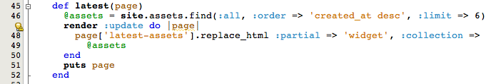](/web/20111127134140/http://wiki.netbeans.org/File:Blockvar_RubyHints.png)

    
The quick fix shows possible fixes:

    
[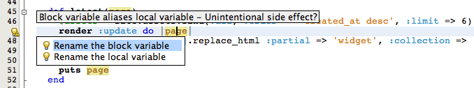](/web/20111127134140/http://wiki.netbeans.org/File:Blockvar-fixes_RubyHints.png)

    
Invoking one of the fixes initiates instant-rename on the relevant references (either
the block references or the local variable references).

    
[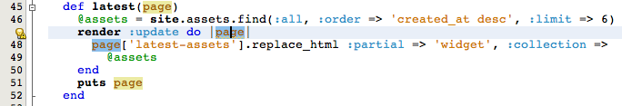](/web/20111127134140/http://wiki.netbeans.org/File:Blockvar-fixing_RubyHints.png)

    
    
    #### Rails Deprecations

    
Identifies deprecated Rails constructs; see
     [http://www.rubyonrails.org/deprecation](https://web.archive.org/web/20111127134140/http://www.rubyonrails.org/deprecation)

    
[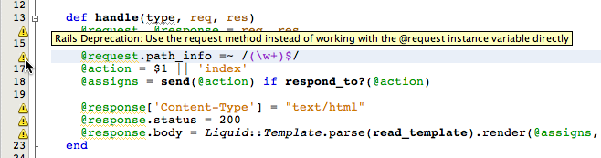](/web/20111127134140/http://wiki.netbeans.org/File:Deprecated-fields_RubyHints.png)

    
Here's another:

    
[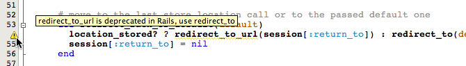](/web/20111127134140/http://wiki.netbeans.org/File:Deprecated-methods_RubyHints.png)

    
    
    #### Code block on single line

    
Code blocks on a single line can optionally be reformatted to span multiple lines

    
Fixes:

    - Reformat code block to span multiple lines

    
[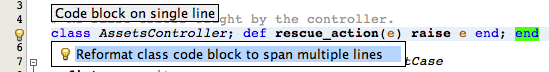](/web/20111127134140/http://wiki.netbeans.org/File:Sameline_RubyHints.png)

    
After applying the above fix:

    
[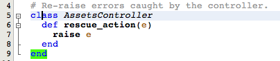](/web/20111127134140/http://wiki.netbeans.org/File:Sameline-expanded_RubyHints.png)

    
    
    ### Additional Hints

    
The following hints were experimental in 6.0 (and not included in the base download, but available on the Update Center).
In 6.1, these hints are all included as standard hints.

    
    
    #### Nested local variable

    
Detects local variable usages that are "nested" (such as in for loops) where the loop variable is being reused

    
Offers the following fixes:

    - Rename the inner variable
- Rename the outer variable

    
[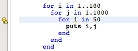](/web/20111127134140/http://wiki.netbeans.org/File:Shadowvar_RubyHints.png)

    
Alt-Enter:

    
[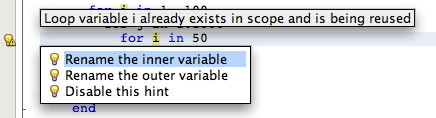](/web/20111127134140/http://wiki.netbeans.org/File:Shadowvar-fix_RubyHints.png)

    
    
    #### Convert between {}-blocks and do/end blocks

    
Convert between {}-blocks and do/end blocks

    
[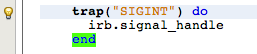](/web/20111127134140/http://wiki.netbeans.org/File:Convertblock_RubyHints.png)

    
Applying fix shows this:

    
[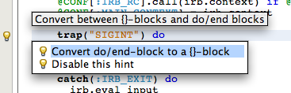](/web/20111127134140/http://wiki.netbeans.org/File:Convertblock-fix_RubyHints.png)

    
The code can also collapse multi-line blocks into a single line block, and vice versa.
Here's a multi-line block:

    
[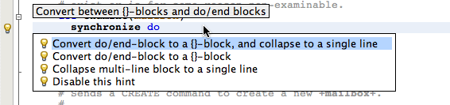](/web/20111127134140/http://wiki.netbeans.org/File:Convert-collapse_RubyHints.png)

    
Here's a single line block:

    
[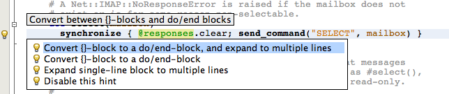](/web/20111127134140/http://wiki.netbeans.org/File:Convert-expand_RubyHints.png)

    
Fixes:

    - Convert {}-block to a do/end-block, and collapse to a single line
- Convert {}-block to a do/end-block
- Convert do/end-block to a {}-block, and collapse to a single line
- Convert do/end-block to a {}-block
- Expand single-line block to multiple lines
- Collapse multi-line block to a single line

    
    
    #### Uppercase constant name check

    
Check constant names to find CamelCase names rather than the preferred CONSTANT style

    
[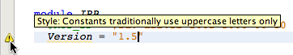](/web/20111127134140/http://wiki.netbeans.org/File:Constantnames_RubyHints.png)

    
    
    #### CamelCase name alert

    
Check method names to find camelCase names instead of the preferred method_name style

    
Fixes:

    - Rename to 
- Rename...

    
[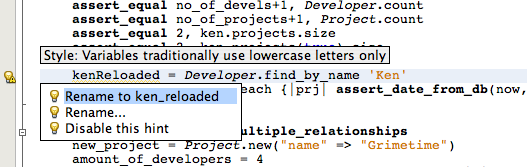](/web/20111127134140/http://wiki.netbeans.org/File:Localvarname-hint_RubyHints.png)

    
    
    #### Check identifiers for unsafe characters

    
Only a-z, A-Z, digits and underscore are safe in identifier names. Other international character can lead to runtime errors.

    
[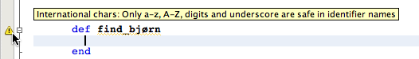](/web/20111127134140/http://wiki.netbeans.org/File:Unsafechars_RubyHints.png)

    
    
    #### Find actions without corresponding view files

    
Locates actions in Rails controller files that don't have a corresponding view file

    
Fixes:

    - Create view (open generator)

    
[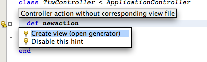](/web/20111127134140/http://wiki.netbeans.org/File:Createview_RubyHints.png)

    
    
    #### Local Attributes

    
Detects cases where a local variable assignment is referring to a local variable

    
```
whose name is identical to an attribute on this class, which is a common source of errors.

```

    
Fixes:

    - Change assignment to self. to use attribute
- Rename local variable to avoid confusion
- Go to the relevant attribute definition ()

    
The following code sample shows the problem:

    
[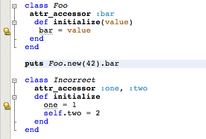](/web/20111127134140/http://wiki.netbeans.org/File:Attribute-hint1_RubyHints.png)

    
Here's the quick fix:

    
[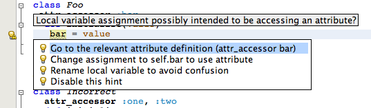](/web/20111127134140/http://wiki.netbeans.org/File:Attribute-hint3_RubyHints.png)

    
    
    ### Error Fixes

    
In additional to flagging possibly bad code, hints can also be keyed off specific parser errors.

    
    
    #### Incorrect =begin/=end blocks

    
Some users filed bugs that =begin/=end wasn't working correctly in NetBeans. The problem was however that they had indented their =begin/=end block, and in Ruby, it *must* appear in column 0. Thus, this hint describes the problem and offers to automatically fix it.

    
Here's the error - notice the lightbulb next to the error stop sign:

    
[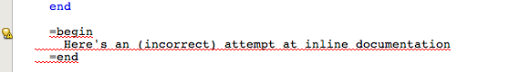](/web/20111127134140/http://wiki.netbeans.org/File:Wrong-documentation_RubyHints.png)

    
And here's the quickfix:

    
[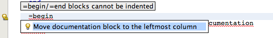](/web/20111127134140/http://wiki.netbeans.org/File:Move-documentation_RubyHints.png)

    
    
    #### Parenthesize Arguments

    
Ruby warns when expressions with arguments really should have parentheses to avoid confusion (and the code may be disallowed in the future). NetBeans offers to fix these problems:

    
[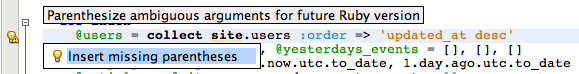](/web/20111127134140/http://wiki.netbeans.org/File:Parenthesize_RubyHints.png)

    

    
    
    #### Extract Method

    
More information
     [here](https://web.archive.org/web/20111127134140/http://blogs.sun.com/tor/entry/extract_method_introduce_variable_introduce)
     .

    
[[1]](https://web.archive.org/web/20111127134140/http://blogs.sun.com/tor/resource/extract_method3.png)

    
    
    #### Introduce Field, Introduce Constant, Introduce Variable

    
[[2]](https://web.archive.org/web/20111127134140/http://blogs.sun.com/tor/resource/introduce2.png)

    
More information
     [here](https://web.archive.org/web/20111127134140/http://blogs.sun.com/tor/entry/extract_method_introduce_variable_introduce)
     .

    
    
    #### Accidental Assignments

    
This tip detects mistakes like the following

    
```

x = 1
y = 2
puts "equal" if x = y

```

    
It also contains a quickfix to fix the problem (change it to
     
      x == y
     
     ).

    
    
    ### Experimental Hints

    
These hints are experimental in the sense that they were recently added. They are not part of the standard download; instead, they
are included in the "Extra Hints" plugin, available from the update center. They are also included in the daily builds on
     [deadlock.netbeans.org](https://web.archive.org/web/20111127134140/http://deadlock.netbeans.org/hudson/job/ruby/)

    
    
    #### Reverse Conditional Logic

    
This quickfix checks if the caret is inside an
     
      if
     
     or
     
      unless
     
     statement, and if so, it offers to replace statements of this form:

    
```

if !x
    ...

```

    
with

    
```

unless x
    ...

```

    
and similarly,

    
```

if foo != bar
    ...

```

    
with

    
```

unless == bar
    ...

```

    
(The opposite scenario, converting
     
      unless !x
     
     to
     
      if x
     
     is also supported).

    
(You can see some screenshots of this in
     [this blog entry](https://web.archive.org/web/20111127134140/http://blogs.sun.com/tor/entry/quick_hi)
     )

    
    
    #### Convert To Statement Modifier

    
This hint will convert
     
      if
     
     /
     
      unless
     
     statements of this form:

    
```

if foo
  bar
end

```

    
into

    
```

bar if foo

```

    
(You can see some screenshots of this in
     [this blog entry](https://web.archive.org/web/20111127134140/http://blogs.sun.com/tor/entry/quick_hi)
     )

    
    
    #### RubyGem Deprecations

    
RubyGems 1.0 is out and has removed the old Kernel#require_gem method (which is used by older versions
of Rails for example).  The deprecation quickfix identifies these usages and offers to fix them.

    
[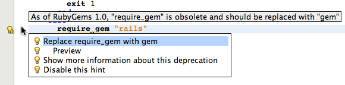](/web/20111127134140/http://wiki.netbeans.org/File:Requiregem2_RubyHints.png)

    
    
    #### Other Deprecations

    
NetBeans also checks for many other deprecated usages. Attempting to require
     
      getopts
     
     ,
     
      parsearg
     
     ,
     
      printenv
     
     or
     
      cgi-lib
     
     will generate warnings, as will the
     
      assert_raises
     
     method from Test::Unit (deprecated in
Rails 1.9).

    
    
    #### Retry Outside Rescue

    
It was
     [just decided](https://web.archive.org/web/20111127134140/http://groups.google.com/group/ruby-talk-google/browse_thread/thread/edf196c3a0f5b5e9)
     that
"retry" must be inside a rescue statement in Ruby 1.9.  This rule detects code where this is not the case, and warns
about it such that you can update your code to work on Ruby 1.9.

    
[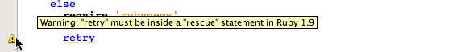](/web/20111127134140/http://wiki.netbeans.org/File:Retry_RubyHints.png)

    

    
    
    #### Case/When Statements With Colons

    
As of Ruby 1.9, you cannot use colons to separate when statements. This quickfix detects this problem and
offers to fix it.

    
[More details in this blog entry](https://web.archive.org/web/20111127134140/http://blogs.sun.com/tor/entry/ruby_screenshot_of_the_week24)

    
[[3]](https://web.archive.org/web/20111127134140/http://blogs.sun.com/tor/resource/when2.png)

    
    
    #### Hash List Conversion

    
As of Ruby 1.9, you can no longer write hashes like this:

    
```

{ "a", "b", "c", "d" }

```

    
You must instead use the following form:

    
```

{ "a" => "b", "c" => "d" }

```

    
This quickfix detects usages of the former construct and offers to convert it to the latter.

    
    
    ### Preferences

    
You can enable and disable hints in the options dialog:

    
[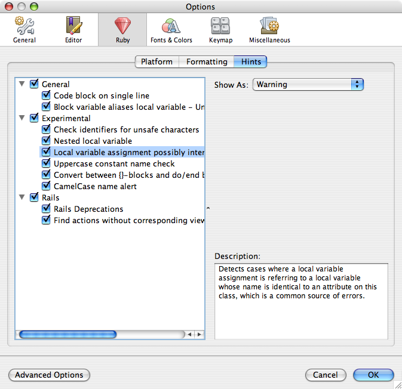](/web/20111127134140/http://wiki.netbeans.org/File:Experimental-hints_RubyHints.png)

    
    
     Retrieved from "
     [http://wiki.netbeans.org/RubyHints](../RubyHints/RubyHints.md)
     "
