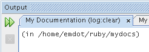
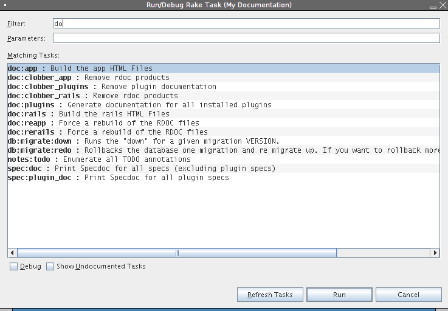

# RubyRake

# RubyRake

    
    
    
    
    
    
     
      
       The information on
       
        this page pertains to NetBeans IDE 6.5
       
       .
      
     
    
    

    
    
    #### Quickly

    
To run a Rake tasks:

    
     
      press
      
       Alt+Shift-R
      
     
     
      type your task (or just a part of it)
     
     
      press
      
       Enter
      
     
    
    
Even quicker then from the command line ;). If you want to run the same task again, just press the
     
      Rerun
     
     button  (the double arrow one) in the associated Output Windows tab.

    

    
    
    #### More details

    
NetBeans provides special Rake Runner dialog from which you may run or debug you Rake tasks. Might be invoked from Ruby or Ruby on Rails projects' context menu or just by pressing
     
      Alt+Shift-R
     
     . If you use the shortcut, NetBeans infers project to be used based on the selection in
     
      Projects view
     
     , currently edited file (its project owner), etc. If you are not satisfied with the inferred project, just select your project in the
     
      Projects view
     
     or just use
     
      Run/Debug Rake Task...
     
     project's context menu item.

    
Screenshot showing Rake Runner for Rails project with Rake task containing 'doc' string.

    

    
    
     Retrieved from "
     [http://wiki.netbeans.org/RubyRake](../RubyRake/RubyRake.md)
     "
